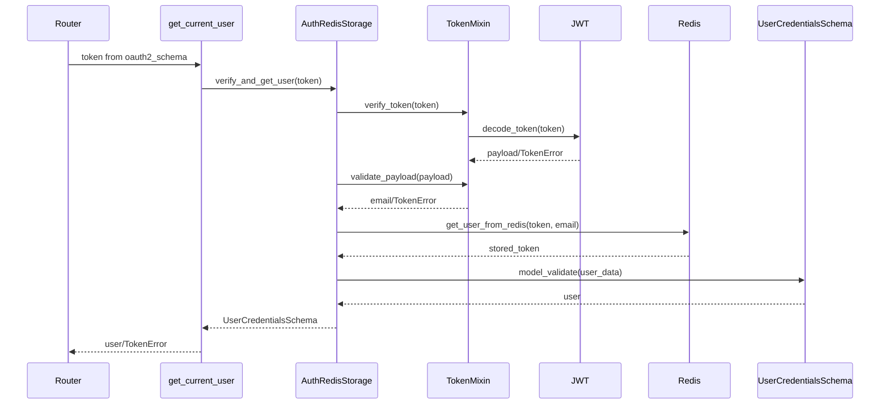

```mermaid
sequenceDiagram
    Router->>get_current_user: token from oauth2_schema
    get_current_user->>AuthRedisStorage: verify_and_get_user(token)

    AuthRedisStorage->>TokenMixin: verify_token(token)
    TokenMixin->>JWT: decode_token(token)
    JWT-->>TokenMixin: payload/TokenError

    AuthRedisStorage->>TokenMixin: validate_payload(payload)
    TokenMixin-->>AuthRedisStorage: email/TokenError

    AuthRedisStorage->>Redis: get_user_from_redis(token, email)
    Redis-->>AuthRedisStorage: stored_token

    AuthRedisStorage->>UserCredentialsSchema: model_validate(user_data)
    UserCredentialsSchema-->>AuthRedisStorage: user

    AuthRedisStorage-->>get_current_user: UserCredentialsSchema
    get_current_user-->>Router: user/TokenError
```