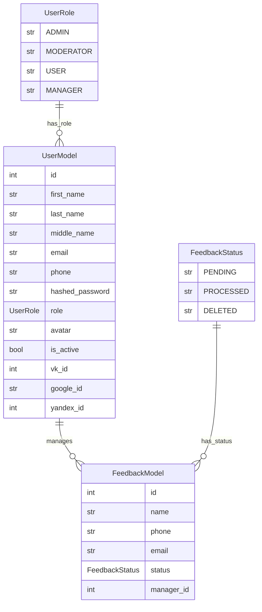

```mermaid
erDiagram
    UserModel ||--o{ FeedbackModel : manages
    UserModel {
        int id
        str first_name
        str last_name
        str middle_name
        str email
        str phone
        str hashed_password
        UserRole role
        str avatar
        bool is_active
        int vk_id
        str google_id
        int yandex_id
    }
    FeedbackModel {
        int id
        str name
        str phone
        str email
        FeedbackStatus status
        int manager_id
    }
    UserRole ||--o{ UserModel : has_role
    FeedbackStatus ||--o{ FeedbackModel : has_status
    UserRole {
        str ADMIN
        str MODERATOR
        str USER
        str MANAGER
    }
    FeedbackStatus {
        str PENDING
        str PROCESSED
        str DELETED
    }


```
