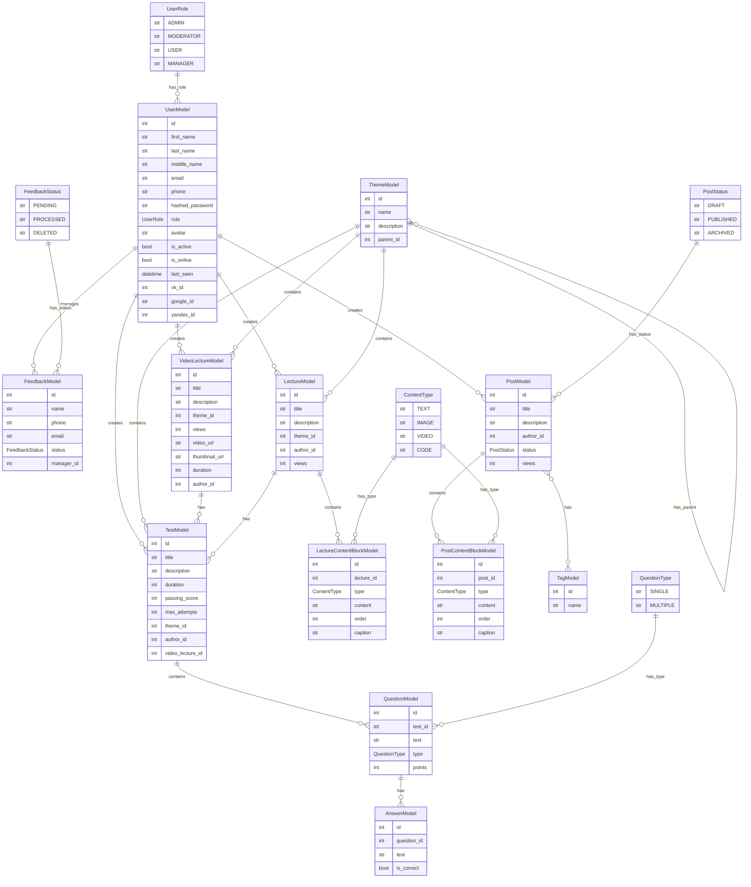

```mermaid
erDiagram
    UserModel ||--o{ FeedbackModel : manages
    UserModel ||--o{ VideoLectureModel : creates
    UserModel ||--o{ TestModel : creates
    UserModel ||--o{ LectureModel : creates
    UserModel ||--o{ PostModel : creates

    ThemeModel ||--o{ VideoLectureModel : contains
    ThemeModel ||--o{ TestModel : contains
    ThemeModel ||--o{ LectureModel : contains
    ThemeModel ||--o{ ThemeModel : has_parent

    VideoLectureModel ||--o{ TestModel : has
    TestModel ||--o{ QuestionModel : contains
    QuestionModel ||--o{ AnswerModel : has

    LectureModel ||--o{ LectureContentBlockModel : contains
    LectureModel ||--o{ TestModel : has

    PostModel ||--o{ PostContentBlockModel : contains
    PostModel }o--o{ TagModel : has

    UserModel {
        int id
        str first_name
        str last_name
        str middle_name
        str email
        str phone
        str hashed_password
        UserRole role
        str avatar
        bool is_active
        bool is_online
        datetime last_seen
        int vk_id
        str google_id
        int yandex_id
    }

    LectureModel {
        int id
        str title
        str description
        int theme_id
        int author_id
        int views
    }

    LectureContentBlockModel {
        int id
        int lecture_id
        ContentType type
        str content
        int order
        str caption
    }

    PostModel {
        int id
        str title
        str description
        int author_id
        PostStatus status
        int views
    }

    PostContentBlockModel {
        int id
        int post_id
        ContentType type
        str content
        int order
        str caption
    }

    TagModel {
        int id
        str name
    }

    FeedbackModel {
        int id
        str name
        str phone
        str email
        FeedbackStatus status
        int manager_id
    }

    ThemeModel {
        int id
        str name
        str description
        int parent_id
    }

    VideoLectureModel {
        int id
        str title
        str description
        int theme_id
        int views
        str video_url
        str thumbnail_url
        int duration
        int author_id
    }

    TestModel {
        int id
        str title
        str description
        int duration
        int passing_score
        int max_attempts
        int theme_id
        int author_id
        int video_lecture_id
    }

    QuestionModel {
        int id
        int test_id
        str text
        QuestionType type
        int points
    }

    AnswerModel {
        int id
        int question_id
        str text
        bool is_correct
    }

    UserRole ||--o{ UserModel : has_role
    FeedbackStatus ||--o{ FeedbackModel : has_status
    QuestionType ||--o{ QuestionModel : has_type
    PostStatus ||--o{ PostModel : has_status
    ContentType ||--o{ LectureContentBlockModel : has_type
    ContentType ||--o{ PostContentBlockModel : has_type

    UserRole {
        str ADMIN
        str MODERATOR
        str USER
        str MANAGER
    }

    FeedbackStatus {
        str PENDING
        str PROCESSED
        str DELETED
    }

    QuestionType {
        str SINGLE
        str MULTIPLE
    }

    PostStatus {
        str DRAFT
        str PUBLISHED
        str ARCHIVED
    }

    ContentType {
        str TEXT
        str IMAGE
        str VIDEO
        str CODE
    }
```
