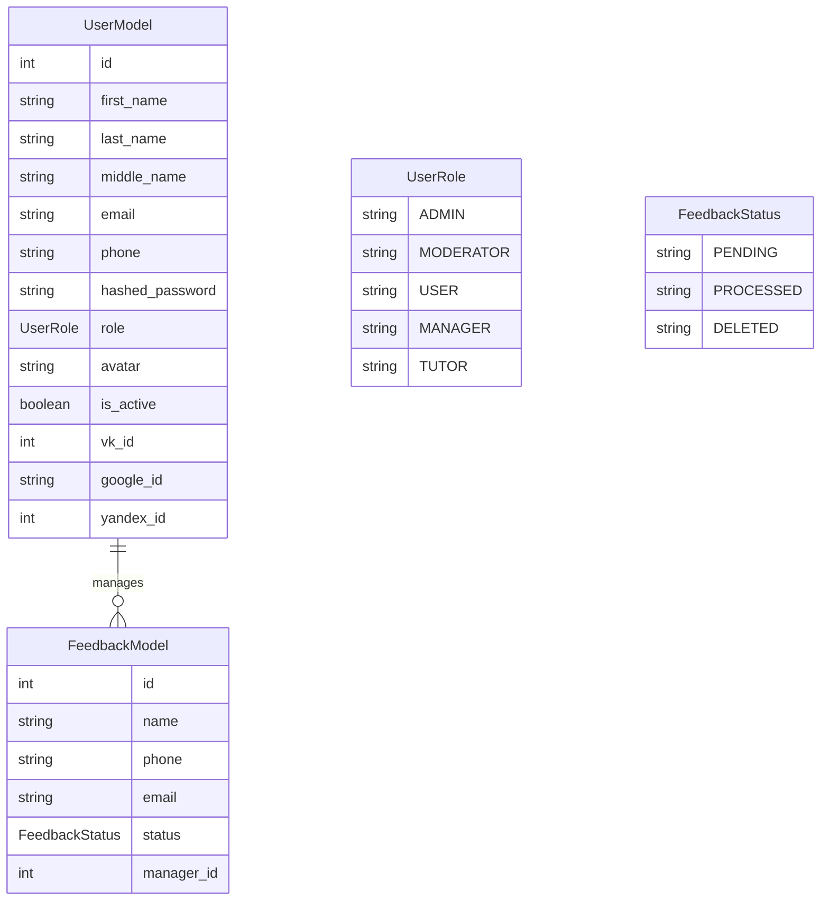
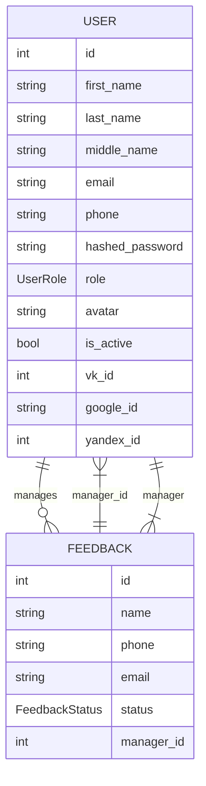

Claude 3.5 Sonnet 

```mermaid
erDiagram
    UserModel ||--o{ FeedbackModel : manages
    UserModel {
        int id
        string first_name
        string last_name
        string middle_name
        string email
        string phone
        string hashed_password
        UserRole role
        string avatar
        boolean is_active
        int vk_id
        string google_id
        int yandex_id
    }
    FeedbackModel {
        int id
        string name
        string phone
        string email
        FeedbackStatus status
        int manager_id
    }
    UserRole {
        string ADMIN
        string MODERATOR
        string USER
        string MANAGER
        string TUTOR
    }
    FeedbackStatus {
        string PENDING
        string PROCESSED
        string DELETED
    }

```

DEEPSEEK

```mermaid
erDiagram
    USER ||--o{ FEEDBACK : manages
    USER {
        int id
        string first_name
        string last_name
        string middle_name
        string email
        string phone
        string hashed_password
        UserRole role
        string avatar
        bool is_active
        int vk_id
        string google_id
        int yandex_id
    }
    FEEDBACK {
        int id
        string name
        string phone
        string email
        FeedbackStatus status
        int manager_id
    }
    USER }|--|| FEEDBACK : "manager_id"
    FEEDBACK }|--|| USER : "manager"
```