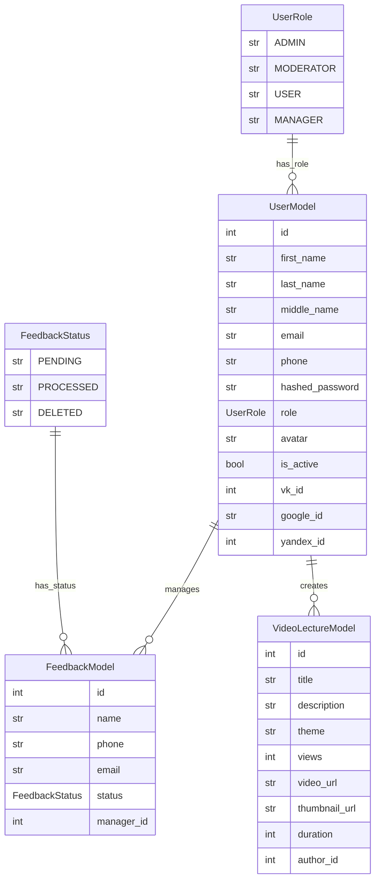

## Описание полей модели VideoLectureModel
- `title`: Название видео лекции. Обязательное поле.
- `description`: Описание видео лекции. Обязательное поле.
- `theme`: Тематика видео лекции. Обязательное поле.
- `views`: Количество просмотров. По умолчанию 0.
- `video_url`: Ссылка на видео. Обязательное поле.
- `duration`: Длительность видео в секундах. Обязательное поле.
- `author_id`: Внешний ключ, ссылающийся на таблицу пользователей (users.id).
Обязательное поле.
- `author`: Отношение к модели UserModel для доступа к данным автора.

## Пример использования:
1. Создание видео лекции:
```python
new_lecture = VideoLectureModel(
    title="Введение в Python",
    description="Основы программирования на Python",
    theme="Программирование",
    video_url="https://youtu.be/dQw4w9WgXcQ?si=qF51Vcoz39ImdOnf",
    duration=3600,  # 1 час
    author_id=1  # ID автора
)
```


Миграции
Для применения изменений в базе данных, создадим миграцию с помощью Alembic:

Создаем миграцию:
```bash
alembic revision --autogenerate -m "Add video_lectures table"
```
Применяем миграцию:
```bash
alembic upgrade head
```