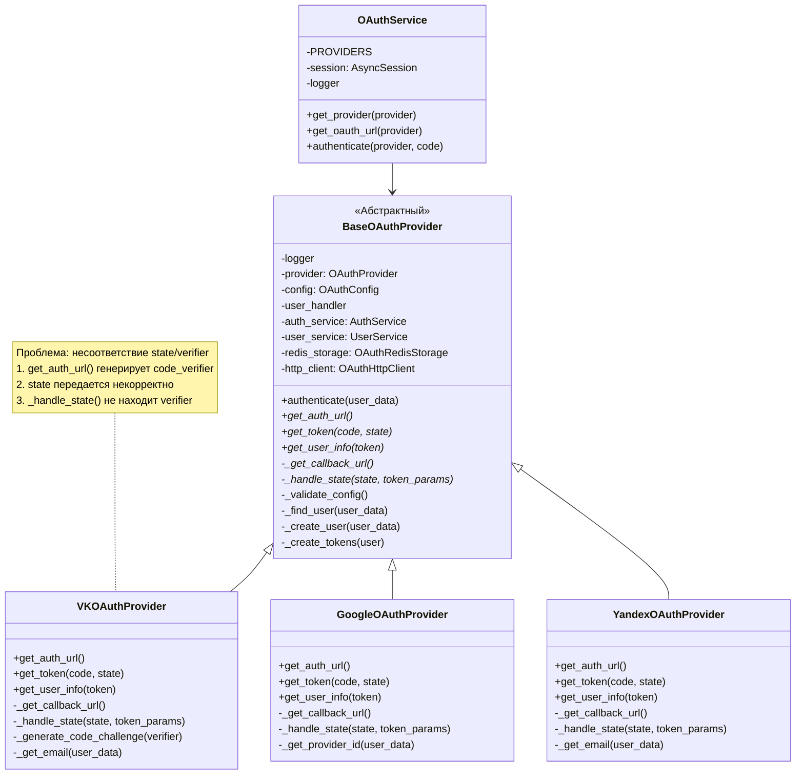

```mermaid
classDiagram
    class BaseOAuthProvider {
        <<Абстрактный>>
        -logger
        -provider: OAuthProvider
        -config: OAuthConfig
        -user_handler
        -auth_service: AuthService
        -user_service: UserService
        -redis_storage: OAuthRedisStorage
        -http_client: OAuthHttpClient
        +authenticate(user_data)
        +get_auth_url()*
        +get_token(code, state)*
        +get_user_info(token)*
        -_get_callback_url()*
        -_handle_state(state, token_params)*
        -_validate_config()
        -_find_user(user_data)
        -_create_user(user_data)
        -_create_tokens(user)
    }

    class VKOAuthProvider {
        +get_auth_url()
        +get_token(code, state)
        +get_user_info(token)
        -_get_callback_url()
        -_handle_state(state, token_params)
        -_generate_code_challenge(verifier)
        -_get_email(user_data)
    }

    class GoogleOAuthProvider {
        +get_auth_url()
        +get_token(code, state) 
        +get_user_info(token)
        -_get_callback_url()
        -_handle_state(state, token_params)
        -_get_provider_id(user_data)
    }

    class YandexOAuthProvider {
        +get_auth_url()
        +get_token(code, state)
        +get_user_info(token)
        -_get_callback_url()
        -_handle_state(state, token_params)
        -_get_email(user_data)
    }

    class OAuthService {
        -PROVIDERS
        -session: AsyncSession
        -logger
        +get_provider(provider)
        +get_oauth_url(provider)
        +authenticate(provider, code)
    }

    BaseOAuthProvider <|-- VKOAuthProvider
    BaseOAuthProvider <|-- GoogleOAuthProvider 
    BaseOAuthProvider <|-- YandexOAuthProvider
    OAuthService --> BaseOAuthProvider

    note for VKOAuthProvider "Проблема: несоответствие state/verifier
    1. get_auth_url() генерирует code_verifier
    2. state передается некорректно
    3. _handle_state() не находит verifier"
```