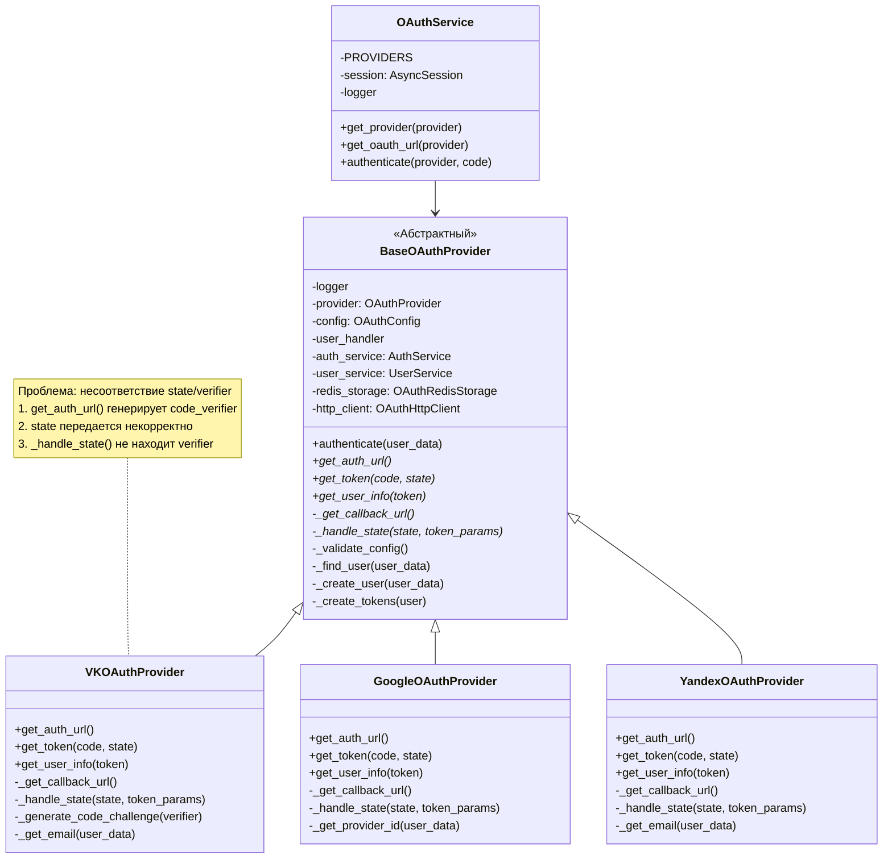
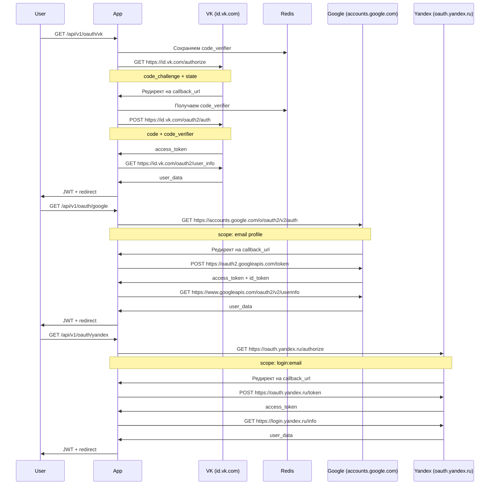
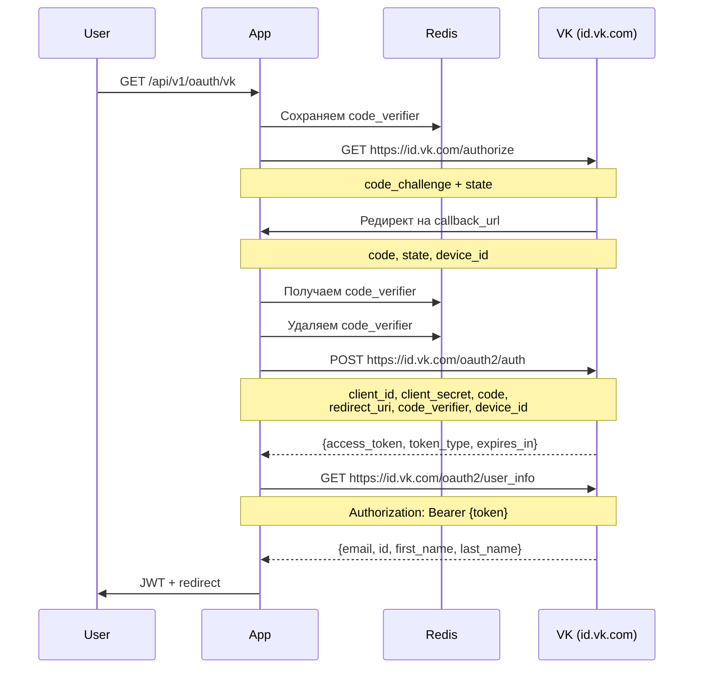

# Class diagrams

# Sequence diagrams


```marmaid
sequenceDiagram
    participant User
    participant App
    participant Redis
    participant VK as VK (id.vk.com)

    %% Initial Auth Request
    User->>App: GET /api/v1/oauth/vk
    Note over App: generate code_verifier & state
    App->>Redis: SET vk_verifier_{state}=code_verifier (300s)
    Note over App: generate code_challenge (S256)
    App->>VK: GET /authorize
    Note over App,VK: client_id, redirect_uri, scope,<br/>state, code_challenge, code_challenge_method

    %% Auth Response & Token Exchange
    VK->>App: Redirect to callback_url
    Note over VK,App: code, state, device_id
    App->>Redis: GET vk_verifier_{state}
    App->>Redis: DELETE vk_verifier_{state}
    App->>VK: POST /oauth2/auth
    Note over App,VK: client_id, client_secret, code,<br/>redirect_uri, code_verifier, device_id

    %% Token Response & User Info
    VK-->>App: {access_token, token_type, expires_in}
    App->>VK: GET /oauth2/user_info
    Note over VK,App: Authorization: Bearer {token}
    VK-->>App: {email, id, first_name, last_name}
    App->>User: JWT + redirect

```
