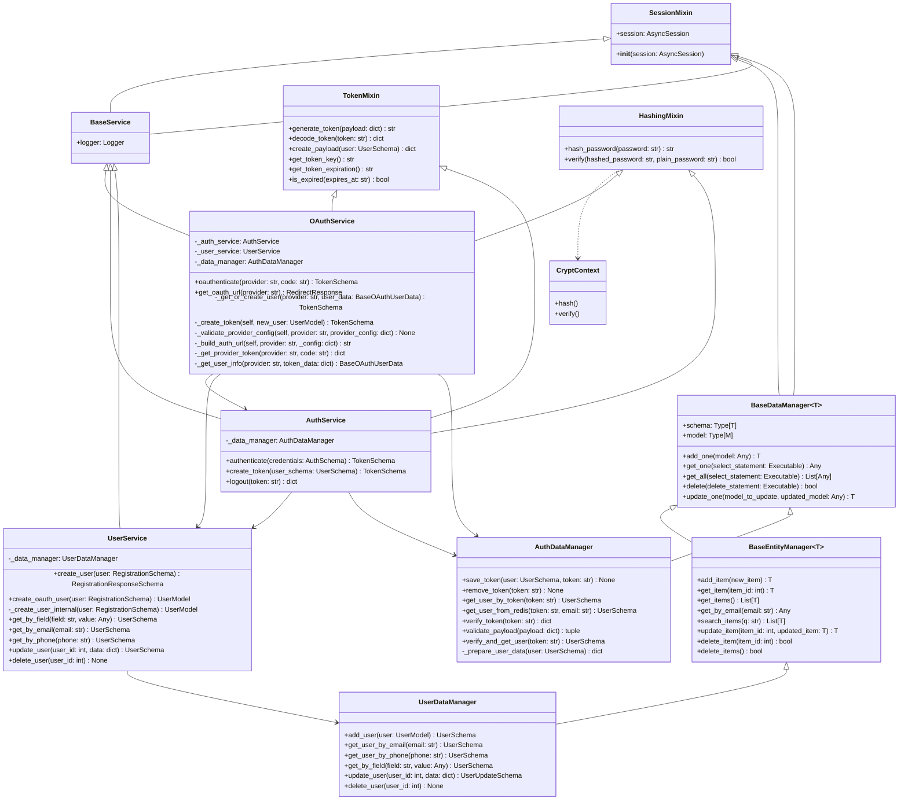

```mermaid
classDiagram
    class SessionMixin {
        +session: AsyncSession
        +__init__(session: AsyncSession)
    }

    class BaseService {
        +logger: Logger
    }

    class TokenMixin {
        +generate_token(payload: dict) str
        +decode_token(token: str) dict
        +create_payload(user: UserSchema) dict
        +get_token_key() str
        +get_token_expiration() str
        +is_expired(expires_at: str) bool
    }

    class HashingMixin {
        +hash_password(password: str) str
        +verify(hashed_password: str, plain_password: str) bool
    }

    class CryptContext {
        +hash()
        +verify()
    }

    class OAuthService {
        -_auth_service: AuthService
        -_user_service: UserService
        -_data_manager: AuthDataManager
        +oauthenticate(provider: str, code: str) TokenSchema
        +get_oauth_url(provider: str) RedirectResponse
        -_get_or_create_user(provider: str, user_data: BaseOAuthUserData) TokenSchema
        -_create_token(self, new_user: UserModel) TokenSchema
        -_validate_provider_config(self, provider: str, provider_config: dict) None
        -_build_auth_url(self, provider: str, _config: dict) str
        -_get_provider_token(provider: str, code: str) dict
        -_get_user_info(provider: str, token_data: dict) BaseOAuthUserData
    }

    class AuthService {
        -_data_manager: AuthDataManager
        +authenticate(credentials: AuthSchema) TokenSchema
        +create_token(user_schema: UserSchema) TokenSchema
        +logout(token: str) dict
    }

    class UserService {
        -_data_manager: UserDataManager
        +create_user(user: RegistrationSchema) RegistrationResponseSchema
        +create_oauth_user(user: RegistrationSchema) UserModel
        -_create_user_internal(user: RegistrationSchema) UserModel
        +get_by_field(field: str, value: Any) UserSchema
        +get_by_email(email: str) UserSchema
        +get_by_phone(phone: str) UserSchema
        +update_user(user_id: int, data: dict) UserSchema
        +delete_user(user_id: int) None
    }

    class BaseDataManager~T~ {
        +schema: Type[T]
        +model: Type[M]
        +add_one(model: Any) T
        +get_one(select_statement: Executable) Any
        +get_all(select_statement: Executable) List[Any]
        +delete(delete_statement: Executable) bool
        +update_one(model_to_update, updated_model: Any) T
    }

    class BaseEntityManager~T~ {
        +add_item(new_item) T
        +get_item(item_id: int) T
        +get_items() List[T]
        +get_by_email(email: str) Any
        +search_items(q: str) List[T]
        +update_item(item_id: int, updated_item: T) T
        +delete_item(item_id: int) bool
        +delete_items() bool
    }

    class AuthDataManager {
        +save_token(user: UserSchema, token: str) None
        +remove_token(token: str) None
        +get_user_by_token(token: str) UserSchema
        +get_user_from_redis(token: str, email: str) UserSchema
        +verify_token(token: str) dict
        +validate_payload(payload: dict) tuple
        +verify_and_get_user(token: str) UserSchema
        -_prepare_user_data(user: UserSchema) dict
    }

    class UserDataManager {
        +add_user(user: UserModel) UserSchema
        +get_user_by_email(email: str) UserSchema
        +get_user_by_phone(phone: str) UserSchema
        +get_by_field(field: str, value: Any) UserSchema
        +update_user(user_id: int, data: dict) UserUpdateSchema
        +delete_user(user_id: int) None
    }


    HashingMixin ..> CryptContext
    BaseService --|> SessionMixin
    BaseDataManager --|> SessionMixin
    SessionMixin <|-- BaseService
    SessionMixin <|-- BaseDataManager
    BaseDataManager <|-- BaseEntityManager
    BaseDataManager  <|-- AuthDataManager
    BaseEntityManager <|-- UserDataManager
    HashingMixin <|-- OAuthService
    TokenMixin <|-- OAuthService
    BaseService <|-- OAuthService
    HashingMixin <|-- AuthService
    TokenMixin <|-- AuthService
    BaseService <|-- AuthService
    BaseService <|-- UserService
    OAuthService --> AuthService
    OAuthService --> UserService
    OAuthService --> AuthDataManager
    AuthService --> UserService
    AuthService --> AuthDataManager
    UserService --> UserDataManager

```